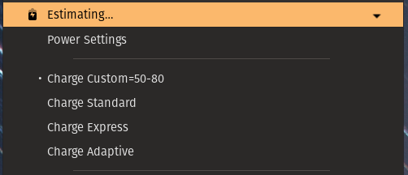

# Gnome shell extension: Dell Command Configure Menu

This extension adds gnome top-bar submenus to access [Dell Command Configure](https://www.dell.com/support/kbdoc/en-uk/000178000/dell-command-configure) options, which needs to be installed separately.



## Supported features

Currently only primary battery charge mode is implemented via `primarybatterycfg` option. Custom charge levels can be chosen in the preferences menu.

* Custom charge mode (set charge levels in preferences)
* Express charge mode
* Adaptive charge mode
* Standard charge mode
* BIOS setup password validation

## Installation from git

```sh
git clone git://github.com/vsimkus/gnome-shell-extension-dell-command-configure-menu.git
cd gnome-shell-extension-dell-command-configure-menu
glib-compile-schemas --strict --targetdir=dell-command-configure-menu@vsimkus.github.io/schemas/ dell-command-configure-menu@vsimkus.github.io/schemas
cp -r dell-command-configure-menu@vsimkus.github.io ~/.local/share/gnome-shell/extensions
```

Restart the shell (`alt + F2` and then `r`) and then enable the extension.

## Installation from extensions.gnome.org

<https://extensions.gnome.org/extension/4545/dell-command-configure-menu/>

## Contributions

Contributions are welcome. Please open a PR or an issue describing in detail what you would like to be added.
